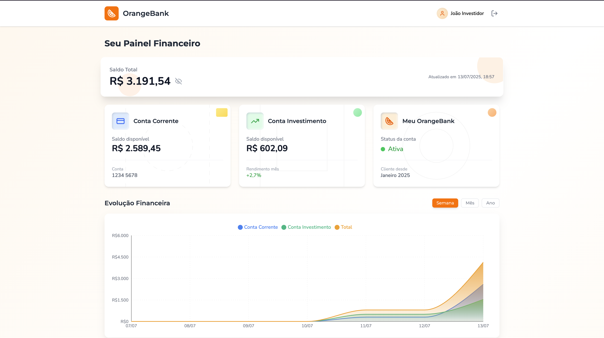
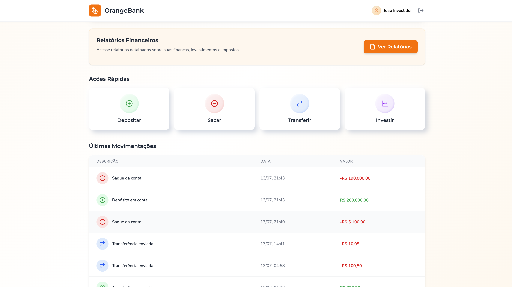
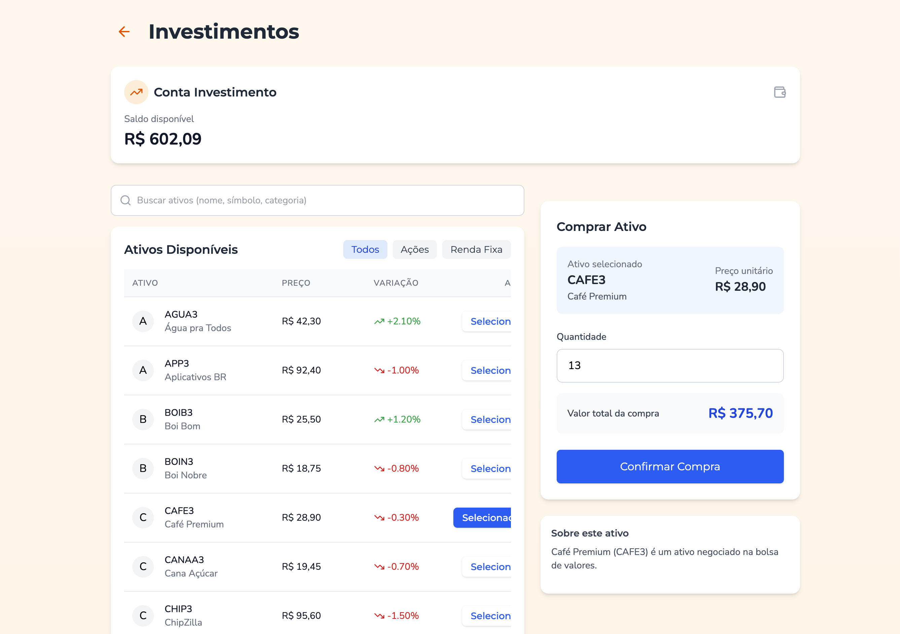

# 🍊 OrangeBank - Seu Banco de Investimentos Digital

> "Porque investir não precisa ser azedo como limão! 🍋 Com a OrangeBank, é doce como laranja! 🍊"

## 📱 Visão Geral

Bem-vindo ao OrangeBank! Desenvolvido como parte do Hackathon da Orange Juice, este projeto simula uma plataforma digital completa de banco de investimentos. Uma solução que permite aos usuários gerenciar suas finanças pessoais e investimentos em um único lugar, com uma interface intuitiva e amigável.

A plataforma foi construída do zero durante o hackathon, com foco em proporcionar uma experiência próxima à de um banco de investimentos real.

## 🚀 Funcionalidades Implementadas

### 🏦 Sistema de Contas

* ✅ Conta Corrente para operações do dia a dia
* ✅ Conta Investimento exclusiva para operações no mercado
* ✅ Dashboard completo com visão consolidada dos saldos

### 💸 Operações Financeiras

* ✅ Depósitos e saques na Conta Corrente
* ✅ Transferências entre contas do mesmo usuário
* ✅ Transferências para outros usuários (com taxa de 0,5%)
* ✅ Histórico completo de transações

### 📈 Investimentos

* ✅ Compra e venda de ações
* ✅ Investimentos em renda fixa (CDB e Tesouro Direto)
* ✅ Cálculo automático de taxas e tributos
* ✅ Simulador de rendimentos para renda fixa

### 📊 Relatórios

* ✅ Resumo de Investimentos com gráficos e tabelas
* ✅ Extrato detalhado de conta
* ✅ Exportação de relatórios em PDF

## 🛠️ Tecnologias Utilizadas

### Backend

* Node.js - Ambiente de execução
* Express - Framework web
* PostgreSQL - Banco de dados relacional
* JWT - Autenticação e segurança

### Frontend

* React - Framework de frontend
* TailwindCSS - Framework CSS
* Lucide React - Ícones modernos
* Chart.js - Visualização de dados
* jsPDF - Geração de relatórios PDF
## 📁 Estrutura do Projeto

```
/
├── assets-mock.json      # Dados simulados para ativos financeiros
├── users-mock.json       # Dados simulados para usuários
├── schema.sql            # Script de criação do banco de dados
├── backend/              # API e lógica de negócios
│   ├── controllers/      # Controladores da aplicação
│   ├── models/           # Modelos de dados
│   ├── routes/           # Rotas da API
│   └── config/           # Configurações
└── frontend/             # Interface do usuário
    ├── public/           # Arquivos estáticos
    └── src/              # Código fonte React
        ├── components/   # Componentes reutilizáveis
        ├── pages/        # Páginas da aplicação
```

## 🏃‍♂️ Como Executar o Projeto

### Pré-requisitos

* Node.js (v14+)
* PostgreSQL (v12+)
* NPM

### Configurando o Backend

```bash
# Clone o repositório
git clone https://github.com/pesiqueiraa/orangebank.git

# Entre na pasta do backend
cd orangebank/backend

# Instale as dependências
npm install

# Configure o banco de dados
# 1. Crie um banco de dados PostgreSQL
# 2. Configure o arquivo .env com suas credenciais (use .env.example como base)
# 3. Execute o script schema.sql para criar as tabelas

# Inicie o servidor
npm start
```

### Configurando o Frontend

```bash
# Entre na pasta do frontend
cd ../frontend

# Instale as dependências
npm install

# Inicie o aplicativo
npm run dev
```


## 🌟 Funcionalidades em Destaque

### Simulador de Rendimentos

Nosso simulador de renda fixa permite que os usuários visualizem projeções de rendimentos para diferentes cenários de investimento. Basta informar o valor inicial, prazo e tipo de investimento para ver quanto seu dinheiro pode render! 💰

### Simulador de Mercado

O simulador de mercado atualiza automaticamente o valor das ações a cada 5 minutos, com variações aleatórias que seguem uma distribuição de probabilidade realista:

* 40% dos casos: variação entre 0,10% e 2%
* 30% dos casos: variação entre 2% e 3%
* 20% dos casos: variação entre 3% e 4%
* 10% dos casos: variação entre 4% e 5%

Isso cria um ambiente dinâmico onde você pode acompanhar suas ações e tomar decisões de compra e venda como no mercado real! 📊

### Sistema de Notificações

Implementamos alertas inteligentes que notificam o usuário sobre:

* Vencimento próximo de investimentos em renda fixa
* Variações significativas no preço das ações em sua carteira
* Confirmação de operações realizadas

### OrangeCoins
&ensp; No OrangeBank, investir ficou ainda mais divertido com as **OrangeCoins**! 🍊

&ensp; Toda vez que você realiza ações na plataforma, como depósitos, saques, transferências, investimentos ou até mesmo gerar relatórios, você ganha OrangeCoins automaticamente. Elas aparecem no seu painel com direito a animação e ranking de níveis, deixando sua experiência mais gamificada e motivadora!

#### Como ganhar OrangeCoins?
- Fazer depósitos, saques e transferências
- Investir em ações ou renda fixa
- Gerar relatórios financeiros
- Completar seu perfil e engajar com a plataforma

#### Para que servem?
Por enquanto, as OrangeCoins são um símbolo do seu engajamento e evolução dentro do OrangeBank. Quanto mais você usa, mais moedas ganha e mais alto sobe de nível! Quem sabe no futuro elas não valem prêmios de verdade? 


## 🖼️ Screenshots

## Tela de Login 

&ensp; Tela de login com autenticação via email e senha, podendo ser acessado com CPF e senha.

<div align="center">
 <sub>Figura 1 - Home/1</sub><br>
 <br>
 <sup>Fonte: Material produzido pelo autor (2025)</sub><br>
</div>

## Dashboard Principal

&ensp; Dashboard principal com visão geral das contas e movimentações recentes
<div align="center">
 <sub>Figura 1 - Home/1</sub><br>
 <br>
 <sup>Fonte: Material produzido pelo autor (2025)</sub><br>
</div>
<div align="center">
 <sub>Figura 2 - Home/2</sub><br>
 <br>
 <sup>Fonte: Material produzido pelo autor (2025)</sub><br>
</div>

## Investimentos
&ensp; Tela de compra de ativos 
<div align="center">
 <sub>Figura 3 - Investimento</sub><br>
 <br>
 <sup>Fonte: Material produzido pelo autor (2025)</sub><br>
</div>

## Relatórios
&ensp; Painel de relatórios com gráficos e possibilidade de exportar por pdf
<div align="center">
 <sub>Figura 4 - Relatórios</sub><br>
 <br>
 <sup>Fonte: Material produzido pelo autor (2025)</sub><br>
</div>


## Link da aplicação
&ensp; Acesse a aplicação em: [OrangeBank](https://orangebank.vercel.app/login)

### Perfil de Teste
&ensp; Utilize o perfil de teste para explorar a plataforma:
- **Email:** `joao.investidor@email.com`
- **Senha:** `123456`

&ensp; Ou fique à vontade para criar sua própria conta!

## 🔮 Melhorias Futuras

Já estamos planejando as próximas atualizações para o OrangeBank:

* 📱 Aplicativo mobile para Android e iOS
* 🔒 Autenticação de dois fatores
* 🤖 Chatbot para atendimento ao cliente
* 📱 Integração com PIX e outros meios de pagamento
* 🧠 Sistema de recomendação de investimentos baseado em IA

## 🏆 Conclusão

O OrangeBank representa nossa visão de como um banco de investimentos digital moderno deveria funcionar: intuitivo, transparente e educativo. Construímos não apenas um sistema funcional, mas uma plataforma que ajuda pessoas a entenderem melhor o mundo dos investimentos.
